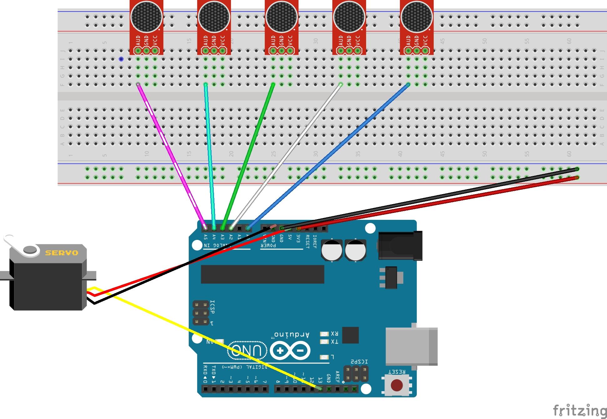

# Sound Localizing Servo
## Introduction
The Sound Localizing Servo is built to detect sound coming from a sensor and move to the position that the sensor picked up. Currently this is a basic version of this idea. The servo will move depending on the microphone with the loudest input. 
## Items
- Standard Servo
- 5x MAX 4466
- Arduino Uno

# Implementation Details
## Microphones
With our implementation, a sample of 100 is read from the microphone modules sequentially. With all 5 sample, we get the average, min and max. With the average, min, and max the algorithm will get the largest delta of each sample. The algorithm will then find the max delta of all, this is then sent to control the servo.

## Servos
The servo will move at a fixed position that will be right infront of the microphone module that has the highest delta. 
## Demo
- [Link to Youtube Video](https://www.youtube.com/shorts/TuTN1Xh6XoU)
- [Link to Youtube Demo Video](https://youtu.be/V1yyWFiiQbc)
## Pin Assignments
All pins are in excel sheet in the sound localization folder. 

This is a small circuit diagram of our project

## Issues Encountered during Development
- In our first iteration we hoped to be able to differentiate a snap, but due to the time frame in which a snap is done, not all of the sensors had enough time get the a sample with the snap.
